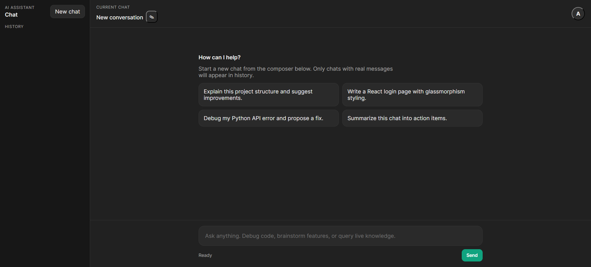
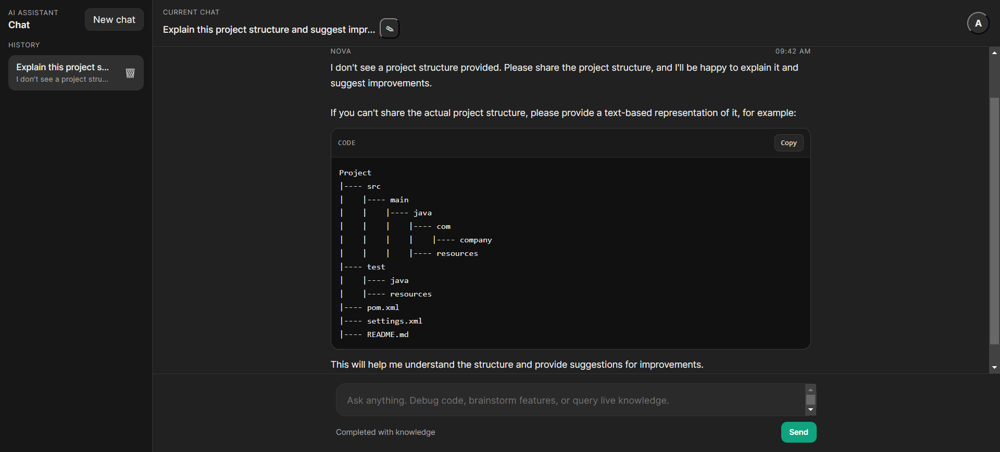
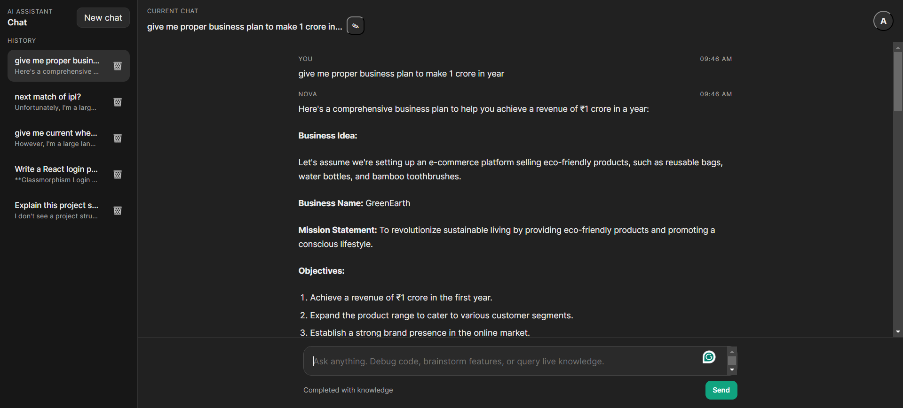

# 🚀 Multi-Agent AI Chatbot (ChatGPT-like)

A production-ready AI chatbot built with Python that uses **multi-agent architecture, real-time search (RAG), memory, and streaming responses** to deliver a ChatGPT-like experience.

---

## 📸 Screenshots






---

## 🧠 Features

- 🤖 **Multi-Agent Architecture**
  - Router Agent decides which agent to use
  - Code Agent for programming queries
  - Knowledge Agent for general queries  

- 🌐 **Real-Time Web Search (RAG)**
  - Automatically fetches latest data when needed  

- 🧠 **Session-Based Memory**
  - Maintains conversation context (multi-turn chat)  

- ⚡ **Streaming Responses**
  - Token-by-token response (like ChatGPT)  

- 🔍 **Smart Query Routing**
  - Detects intent and routes dynamically  

---

## 🛠️ Tech Stack

- **Backend:** Python, FastAPI  
- **LLM API:** Groq  
- **Search:** DDGS (DuckDuckGo Search)  
- **Memory:** In-memory session store  
- **Streaming:** FastAPI StreamingResponse  

---

## ⚙️ Installation

### 1️⃣ Clone Repository

```bash
git clone https://github.com/your-username/ai-chatbot.git
cd ai-chatbot
python -m venv venv
venv\Scripts\activate   # Windows
# source venv/bin/activate  # Mac/Linux

pip install -r requirements.txt

GROQ_API_KEY=your_api_key_here

uvicorn app:app --reload


